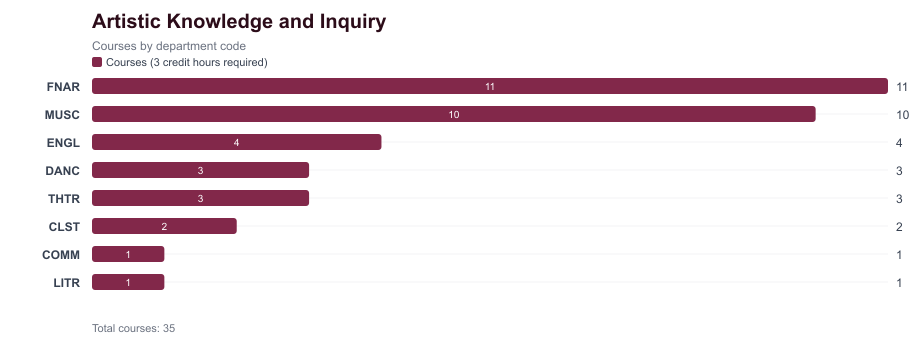
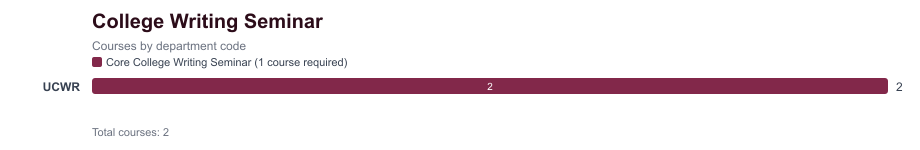
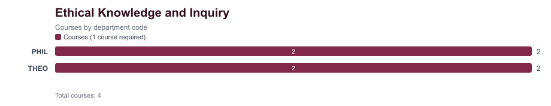
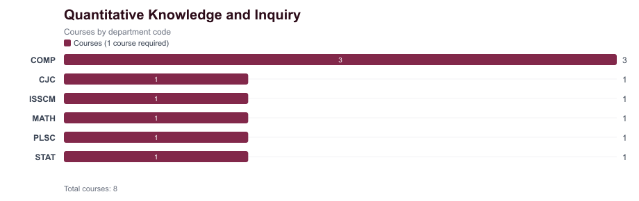
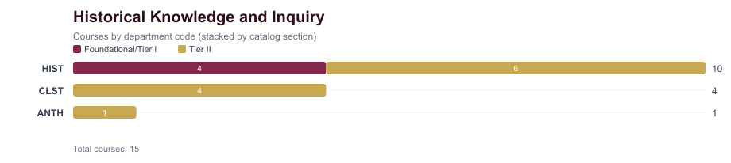
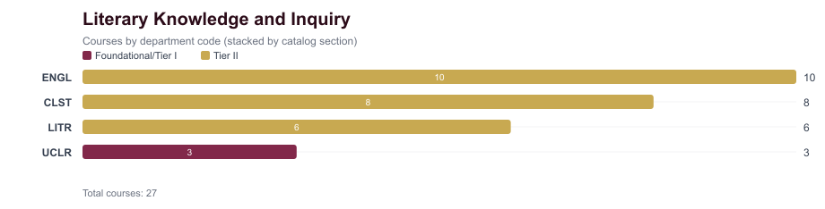
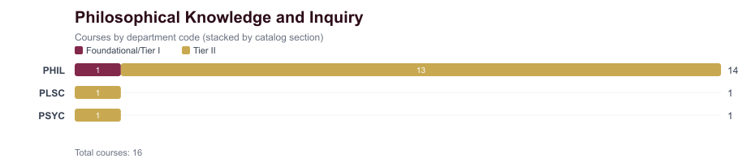
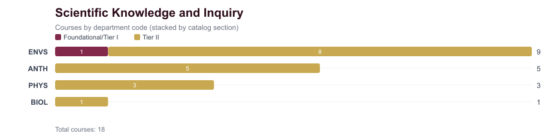
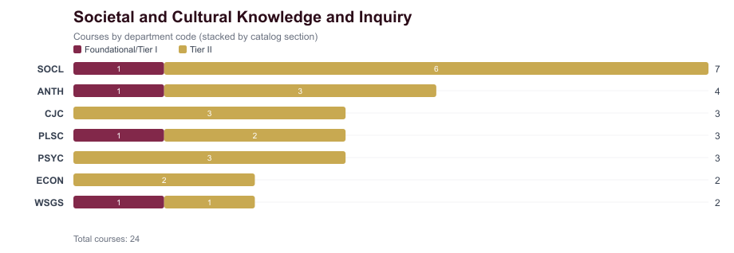
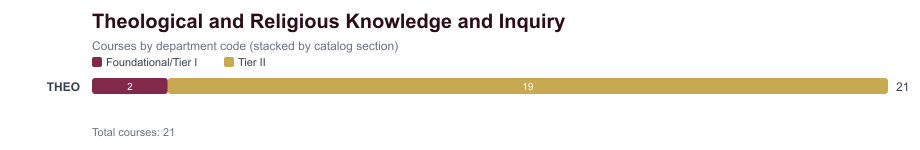

# Loyola University Chicago Core Course Analysis

Source: https://catalog.luc.edu/undergraduate/university-requirements/university-core/core-area-and-courses/
Catalog: 2026-2027

This document summarizes the University Core course inventory currently captured for the advising checklist app. It is intended as a discussion artifact for future work with administrators and advisors.

## Summary

| Core Area | Requirement IDs Used In App | Structure | Required Courses | Required Credits | Catalog Courses Captured |
| --- | --- | --- | ---: | ---: | ---: |
| Artistic Knowledge and Inquiry | `CORE_ART` | Single-area | 1 | 3 | 35 |
| College Writing Seminar | `CORE_WRITING` | Single-area | 1 | 3 | 2 |
| Ethical Knowledge and Inquiry | `CORE_ETHICS` | Single-area | 1 | 3 | 4 |
| Quantitative Knowledge and Inquiry | `CORE_QUANT` | Single-area | 1 | 3 | 8 |
| Historical Knowledge and Inquiry | `CORE_HIST1`, `CORE_HIST2` | Tiered | 2 | 6 | 15 |
| Literary Knowledge and Inquiry | `CORE_LIT1`, `CORE_LIT2` | Tiered | 2 | 6 | 27 |
| Philosophical Knowledge and Inquiry | `CORE_PHIL1`, `CORE_PHIL2` | Tiered | 2 | 6 | 16 |
| Scientific Knowledge and Inquiry | `CORE_SCI1`, `CORE_SCI2` | Tiered | 2 | 6 | 18 |
| Societal and Cultural Knowledge and Inquiry | `CORE_SOC1`, `CORE_SOC2` | Tiered | 2 | 6 | 24 |
| Theological and Religious Knowledge and Inquiry | `CORE_THEO1`, `CORE_THEO2` | Tiered | 2 | 6 | 21 |

## Notes For Advising Checklist Integration

- Not all Core Areas are tiered. Artistic, Writing, Ethics, and Quantitative are single-area requirements.
- Historical, Literary, Philosophical, Scientific, Societal/Cultural, and Theological/Religious are tiered areas with Foundational/Tier I and Tier II course lists.
- Department-code histograms count catalog-listed courses by the prefix before the course number, such as `COMP`, `HIST`, or `THEO`.
- For tiered areas, histograms and department tables break counts out by catalog section.
- Many catalog tables list hours at the requirement/group level rather than on each individual course row. For this application inventory, blank course-level hours are treated as 3 credits by default; explicit catalog row values, such as UCWR 109 at 6 credits, are preserved.
- Courses marked with a diversity designation in the catalog are noted with `Yes` in the Diversity column.
- This inventory is a catalog-derived starting point. It should be confirmed with advising/admin stakeholders before driving official degree-audit behavior.

## Core Areas And Courses

### Artistic Knowledge and Inquiry

Source: https://catalog.luc.edu/undergraduate/university-requirements/university-core/core-area-and-courses/artistic-knowledge-experience/

Requirement IDs used in app: `CORE_ART`

Required courses: 1

Required credits: 3

Chart files: [PNG](docs/core-charts/artistic.png) | [SVG](docs/core-charts/artistic.svg)

#### Department Counts

| Department | Courses (3 credit hours required) | Total |
| --- | ---: | ---: |
| FNAR | 11 | 11 |
| MUSC | 10 | 10 |
| ENGL | 4 | 4 |
| DANC | 3 | 3 |
| THTR | 3 | 3 |
| CLST | 2 | 2 |
| COMM | 1 | 1 |
| LITR | 1 | 1 |

#### Courses (3 credit hours required)

| Code | Department | Title | Credits | Diversity |
| --- | --- | --- | ---: | --- |
| CLST 206 | CLST | Art of Ancient Greece | 3 |  |
| CLST 207 | CLST | Art of the Roman World | 3 |  |
| COMM 274 | COMM | Introduction to Cinema | 3 |  |
| DANC 111 | DANC | Ballet I: Introduction to Ballet Theory and Technique | 3 |  |
| DANC 121 | DANC | Modern Dance I: Theories and Techniques | 3 |  |
| DANC 131 | DANC | Jazz Dance I: Theories and Techniques | 3 |  |
| ENGL 317 | ENGL | The Writing of Poetry | 3 |  |
| ENGL 318 | ENGL | The Writing of Fiction | 3 |  |
| ENGL 318R | ENGL | The Writing of Fiction: Writing Rome | 3 |  |
| ENGL 319 | ENGL | Writing Creative Nonfiction | 3 |  |
| FNAR 113 | FNAR | Drawing I | 3 |  |
| FNAR 114 | FNAR | Painting I | 3 |  |
| FNAR 115 | FNAR | Foundations of Photography | 3 |  |
| FNAR 120 | FNAR | Ceramics: Handbuilding | 3 |  |
| FNAR 121 | FNAR | Ceramics: Wheelthrowing | 3 |  |
| FNAR 124 | FNAR | Sculpture Foundations | 3 |  |
| FNAR 199 | FNAR | Art and Visual Culture | 3 |  |
| FNAR 200 | FNAR | Global Art History: Prehistoric to 600 CE | 3 |  |
| FNAR 201 | FNAR | Global Art History: 600-1800CE | 3 |  |
| FNAR 202 | FNAR | Global Art History: Modern Art | 3 |  |
| FNAR 342 | FNAR | Art in Rome | 3 |  |
| LITR 264 | LITR | Italian Film Genre | 3 |  |
| MUSC 101 | MUSC | Music: Art of Listening | 3 |  |
| MUSC 102 | MUSC | Class Piano for Beginners | 3 |  |
| MUSC 103 | MUSC | Class Guitar for Beginners | 3 |  |
| MUSC 105 | MUSC | Symphony Orchestra | 3 |  |
| MUSC 107 | MUSC | Chorus | 3 |  |
| MUSC 108 | MUSC | Liturgical Choir: Cantorum | 3 |  |
| MUSC 109 | MUSC | Jazz Ensemble | 3 |  |
| MUSC 110 | MUSC | Wind Ensemble | 3 |  |
| MUSC 142 | MUSC | Class Voice for Beginners | 3 |  |
| MUSC 154R | MUSC | Introduction to Opera in Rome | 3 |  |
| THTR 100 | THTR | Intro to Theatre Experience | 3 |  |
| THTR 252 | THTR | Theatrical Design I | 3 |  |
| THTR 261 | THTR | Beginning Acting | 3 |  |

### College Writing Seminar

Source: https://catalog.luc.edu/undergraduate/university-requirements/university-core/core-area-and-courses/college-writing-seminar/

Requirement IDs used in app: `CORE_WRITING`

Required courses: 1

Required credits: 3

Chart files: [PNG](docs/core-charts/writing.png) | [SVG](docs/core-charts/writing.svg)

#### Department Counts

| Department | Core College Writing Seminar (1 course required) | Total |
| --- | ---: | ---: |
| UCWR | 2 | 2 |

#### Core College Writing Seminar (1 course required)

| Code | Department | Title | Credits | Diversity |
| --- | --- | --- | ---: | --- |
| UCWR 109 | UCWR | University Core Writing Seminar: Writing Responsibly Writing Lab | 6 |  |
| UCWR 110 | UCWR | Writing Responsibly | 3 |  |

### Ethical Knowledge and Inquiry

Source: https://catalog.luc.edu/undergraduate/university-requirements/university-core/core-area-and-courses/ethical-knowledge-inquiry/

Requirement IDs used in app: `CORE_ETHICS`

Required courses: 1

Required credits: 3

Chart files: [PNG](docs/core-charts/ethics.png) | [SVG](docs/core-charts/ethics.svg)

#### Department Counts

| Department | Courses (1 course required) | Total |
| --- | ---: | ---: |
| PHIL | 2 | 2 |
| THEO | 2 | 2 |

#### Courses (1 course required)

| Code | Department | Title | Credits | Diversity |
| --- | --- | --- | ---: | --- |
| PHIL 181 | PHIL | Ethics | 3 |  |
| PHIL 182 | PHIL | Social and Political Philosophy | 3 |  |
| THEO 185 | THEO | Christian Ethics | 3 |  |
| THEO 186 | THEO | Global Religious Ethics | 3 |  |

### Quantitative Knowledge and Inquiry

Source: https://catalog.luc.edu/undergraduate/university-requirements/university-core/core-area-and-courses/quantitative-knowledge-inquiry/

Requirement IDs used in app: `CORE_QUANT`

Required courses: 1

Required credits: 3

Chart files: [PNG](docs/core-charts/quantitative.png) | [SVG](docs/core-charts/quantitative.svg)

#### Department Counts

| Department | Courses (1 course required) | Total |
| --- | ---: | ---: |
| COMP | 3 | 3 |
| CJC | 1 | 1 |
| ISSCM | 1 | 1 |
| MATH | 1 | 1 |
| PLSC | 1 | 1 |
| STAT | 1 | 1 |

#### Courses (1 course required)

| Code | Department | Title | Credits | Diversity |
| --- | --- | --- | ---: | --- |
| CJC 206 | CJC | Statistics | 3 |  |
| COMP 122 | COMP | Introduction to Digital Music | 3 |  |
| COMP 125 | COMP | Visual Information Processing | 3 |  |
| COMP 150 | COMP | Introduction to Computing | 3 |  |
| ISSCM 241 | ISSCM | Business Statistics | 3 |  |
| MATH 108 | MATH | Real World Modeling with Mathematics | 3 |  |
| PLSC 216 | PLSC | Political Numbers | 3 |  |
| STAT 103 | STAT | Fundamentals of Statistics | 3 |  |

### Historical Knowledge and Inquiry

Source: https://catalog.luc.edu/undergraduate/university-requirements/university-core/core-area-and-courses/historical-knowledge-inquiry/

Requirement IDs used in app: `CORE_HIST1`, `CORE_HIST2`

Required courses: 2

Required credits: 6

Chart files: [PNG](docs/core-charts/historical.png) | [SVG](docs/core-charts/historical.svg)

#### Department Counts

| Department | Foundational/Tier I | Tier II | Total |
| --- | ---: | ---: | ---: |
| HIST | 4 | 6 | 10 |
| CLST | 0 | 4 | 4 |
| ANTH | 0 | 1 | 1 |

#### Foundational/Tier I

| Code | Department | Title | Credits | Diversity |
| --- | --- | --- | ---: | --- |
| HIST 101 | HIST | Culture, Power and Identity: Western Ideas & Institutions to 17th Century | 3 |  |
| HIST 102 | HIST | Culture, Power and Identity: Western Ideas & Institutions from 17th Century | 3 |  |
| HIST 103 | HIST | American Pluralism | 3 | Yes |
| HIST 104 | HIST | Global History Since 1500 | 3 | Yes |

#### Tier II

| Code | Department | Title | Credits | Diversity |
| --- | --- | --- | ---: | --- |
| ANTH 107 | ANTH | Ancient Worlds | 3 | Yes |
| CLST 274 | CLST | World of Archaic Greece | 3 |  |
| CLST 275 | CLST | World of Classical Greece | 3 |  |
| CLST 276 | CLST | World of Classical Rome | 3 |  |
| CLST 277 | CLST | World of Late Antiquity | 3 |  |
| HIST 208 | HIST | East Asian History: Themes & Issues | 3 | Yes |
| HIST 209 | HIST | Islamic History: Themes & Issues | 3 | Yes |
| HIST 210 | HIST | Latin American History: Themes & Issues | 3 | Yes |
| HIST 211 | HIST | US History to 1865: Themes & Issues | 3 |  |
| HIST 212 | HIST | US History since 1865: Themes & Issues | 3 |  |
| HIST 213 | HIST | African History: Themes & Issues | 3 | Yes |

### Literary Knowledge and Inquiry

Source: https://catalog.luc.edu/undergraduate/university-requirements/university-core/core-area-and-courses/literary-knowledge-inquiry/

Requirement IDs used in app: `CORE_LIT1`, `CORE_LIT2`

Required courses: 2

Required credits: 6

Chart files: [PNG](docs/core-charts/literary.png) | [SVG](docs/core-charts/literary.svg)

#### Department Counts

| Department | Foundational/Tier I | Tier II | Total |
| --- | ---: | ---: | ---: |
| ENGL | 0 | 10 | 10 |
| CLST | 0 | 8 | 8 |
| LITR | 0 | 6 | 6 |
| UCLR | 3 | 0 | 3 |

#### Foundational/Tier I

| Code | Department | Title | Credits | Diversity |
| --- | --- | --- | ---: | --- |
| UCLR 100C | UCLR | Interpreting Literature - Classical Studies | 3 |  |
| UCLR 100E | UCLR | Interpreting Literature - English | 3 |  |
| UCLR 100M | UCLR | Interpreting Literature - Modern Langs&Literatures | 3 |  |

#### Tier II

| Code | Department | Title | Credits | Diversity |
| --- | --- | --- | ---: | --- |
| CLST 271 | CLST | Classical Mythology | 3 |  |
| CLST 271G | CLST | Classical Mythology - Women/Gender Focus | 3 | Yes |
| CLST 272 | CLST | Heroes & the Classical Epics | 3 |  |
| CLST 273 | CLST | Classical Tragedy | 3 |  |
| CLST 273G | CLST | Classical Tragedy - Women/Gender Focus | 3 | Yes |
| CLST 279 | CLST | Classical Rhetoric | 3 |  |
| CLST 280 | CLST | Romance Novel in Ancient World | 3 |  |
| CLST 283 | CLST | Classical Comedy & Satire | 3 |  |
| ENGL 271 | ENGL | Exploring Poetry | 3 |  |
| ENGL 272 | ENGL | Exploring Drama | 3 |  |
| ENGL 273 | ENGL | Exploring Fiction | 3 |  |
| ENGL 274 | ENGL | Exploring Shakespeare | 3 |  |
| ENGL 282 | ENGL | African-American Literature | 3 | Yes |
| ENGL 283 | ENGL | Women in Literature | 3 |  |
| ENGL 284 | ENGL | Asian American Literature | 3 | Yes |
| ENGL 287 | ENGL | Religion and Literature | 3 |  |
| ENGL 288 | ENGL | Nature in Literature | 3 |  |
| ENGL 290 | ENGL | Human Values in Literature | 3 |  |
| LITR 200 | LITR | European Masterpieces | 3 |  |
| LITR 202 | LITR | European Novel | 3 |  |
| LITR 238 | LITR | Arabic Literature in Translation | 3 | Yes |
| LITR 245 | LITR | Asian Masterpieces | 3 | Yes |
| LITR 280 | LITR | World Masterpieces in Translation | 3 | Yes |
| LITR 283 | LITR | Major Authors in Translation | 3 |  |

### Philosophical Knowledge and Inquiry

Source: https://catalog.luc.edu/undergraduate/university-requirements/university-core/core-area-and-courses/philosophical-knowledge-inquiry/

Requirement IDs used in app: `CORE_PHIL1`, `CORE_PHIL2`

Required courses: 2

Required credits: 6

Chart files: [PNG](docs/core-charts/philosophical.png) | [SVG](docs/core-charts/philosophical.svg)

#### Department Counts

| Department | Foundational/Tier I | Tier II | Total |
| --- | ---: | ---: | ---: |
| PHIL | 1 | 13 | 14 |
| PLSC | 0 | 1 | 1 |
| PSYC | 0 | 1 | 1 |

#### Foundational/Tier I

| Code | Department | Title | Credits | Diversity |
| --- | --- | --- | ---: | --- |
| PHIL 130 | PHIL | Philosophy & Persons | 3 |  |

#### Tier II

| Code | Department | Title | Credits | Diversity |
| --- | --- | --- | ---: | --- |
| PHIL 271 | PHIL | Philosophy of Religion | 3 |  |
| PHIL 272 | PHIL | Metaphysics | 3 |  |
| PHIL 273 | PHIL | Philosophy of Science | 3 |  |
| PHIL 274 | PHIL | Logic | 3 |  |
| PHIL 275 | PHIL | Theory of Knowledge | 3 |  |
| PHIL 277 | PHIL | Aesthetics | 3 |  |
| PHIL 277R | PHIL | Aesthetics: the Aesthetic Experience in Rome | 3 |  |
| PHIL 279 | PHIL | Judgment and Decision-Making | 3 |  |
| PHIL 284 | PHIL | Health Care Ethics | 3 |  |
| PHIL 286 | PHIL | Ethics and Education | 3 |  |
| PHIL 287 | PHIL | Environmental Ethics | 3 |  |
| PHIL 288 | PHIL | Culture and Civilization | 3 |  |
| PHIL 288R | PHIL | Culture & Civilization in Rome | 3 |  |
| PLSC 100 | PLSC | Political Theory | 3 |  |
| PSYC 280 | PSYC | Psychology of Judgment and Decision-Making | 3 |  |

### Scientific Knowledge and Inquiry

Source: https://catalog.luc.edu/undergraduate/university-requirements/university-core/core-area-and-courses/scientific-knowledge-inquiry/

Requirement IDs used in app: `CORE_SCI1`, `CORE_SCI2`

Required courses: 2

Required credits: 6

Chart files: [PNG](docs/core-charts/scientific.png) | [SVG](docs/core-charts/scientific.svg)

#### Department Counts

| Department | Foundational/Tier I | Tier II | Total |
| --- | ---: | ---: | ---: |
| ENVS | 1 | 8 | 9 |
| ANTH | 0 | 5 | 5 |
| PHYS | 0 | 3 | 3 |
| BIOL | 0 | 1 | 1 |

#### Foundational/Tier I

| Code | Department | Title | Credits | Diversity |
| --- | --- | --- | ---: | --- |
| ENVS 101 | ENVS | The Scientific Basis of Environmental Issues | 3 |  |

#### Tier II

| Code | Department | Title | Credits | Diversity |
| --- | --- | --- | ---: | --- |
| ANTH 101 | ANTH | Human Origins | 3 | Yes |
| ANTH 103 | ANTH | Biological Background Human Social Behavior | 3 | Yes |
| ANTH 104 | ANTH | The Human Ecological Footprint | 3 |  |
| ANTH 105 | ANTH | Human Biocultural Diversity | 3 | Yes |
| ANTH 106 | ANTH | Sex, Science and Anthropological Inquiry | 3 | Yes |
| BIOL 110 | BIOL | Liberal Arts Biology | 3 |  |
| ENVS 207 | ENVS | Plants and Civilization | 3 |  |
| ENVS 218 | ENVS | Biodiversity & Biogeography | 3 |  |
| ENVS 223 | ENVS | Soil Ecology | 3 |  |
| ENVS 224 | ENVS | Climate & Climate Change | 3 |  |
| ENVS 226 | ENVS | Science & Conservation of Freshwater Ecosystems | 3 |  |
| ENVS 273 | ENVS | Energy and the Environment | 3 |  |
| ENVS 281 | ENVS | Environmental Sustainability & Science in China | 3 |  |
| ENVS 283 | ENVS | Environmental Sustainability | 3 |  |
| PHYS 101 | PHYS | Liberal Arts Physics | 3 |  |
| PHYS 102 | PHYS | Planetary and Stellar Astronomy | 3 |  |
| PHYS 106 | PHYS | Physics of Music | 3 |  |

### Societal and Cultural Knowledge and Inquiry

Source: https://catalog.luc.edu/undergraduate/university-requirements/university-core/core-area-and-courses/societal-cultural-knowledge-inquiry/

Requirement IDs used in app: `CORE_SOC1`, `CORE_SOC2`

Required courses: 2

Required credits: 6

Chart files: [PNG](docs/core-charts/societal.png) | [SVG](docs/core-charts/societal.svg)

#### Department Counts

| Department | Foundational/Tier I | Tier II | Total |
| --- | ---: | ---: | ---: |
| SOCL | 1 | 6 | 7 |
| ANTH | 1 | 3 | 4 |
| CJC | 0 | 3 | 3 |
| PLSC | 1 | 2 | 3 |
| PSYC | 0 | 3 | 3 |
| ECON | 0 | 2 | 2 |
| WSGS | 1 | 1 | 2 |

#### Foundational/Tier I

| Code | Department | Title | Credits | Diversity |
| --- | --- | --- | ---: | --- |
| ANTH 100 | ANTH | Globalization and Local Cultures | 3 | Yes |
| PLSC 102 | PLSC | International Relations in an Age of Globalization | 3 | Yes |
| SOCL 101 | SOCL | Society in a Global Age | 3 | Yes |
| WSGS 101 | WSGS | Introduction to WSGS from a Global Perspective | 3 | Yes |

#### Tier II

| Code | Department | Title | Credits | Diversity |
| --- | --- | --- | ---: | --- |
| ANTH 102 | ANTH | Culture, Society, and Diversity | 3 | Yes |
| ANTH 203 | ANTH | Violence, Social Suffering, and Justice | 3 | Yes |
| ANTH 208 | ANTH | Language and Identity | 3 | Yes |
| CJC 345 | CJC | Social Justice and Crime | 3 | Yes |
| CJC 370 | CJC | Women in The Criminal Justice System | 3 | Yes |
| CJC 372 | CJC | Race, Ethnicity, and Criminal Justice | 3 | Yes |
| ECON 201 | ECON | Principles of Microeconomics | 3 |  |
| ECON 202 | ECON | Principles of Macroeconomics | 3 |  |
| PLSC 101 | PLSC | American Politics | 3 |  |
| PLSC 103 | PLSC | Comparative Politics | 3 |  |
| PSYC 101 | PSYC | General Psychology | 3 |  |
| PSYC 238 | PSYC | Psychology of Gender | 3 | Yes |
| PSYC 275 | PSYC | Social Psychology | 3 | Yes |
| SOCL 121 | SOCL | Social Problems | 3 | Yes |
| SOCL 122 | SOCL | Race and Ethnic Relations | 3 | Yes |
| SOCL 125 | SOCL | Chicago: Urban Metropolis | 3 | Yes |
| SOCL 145 | SOCL | Religion & Society | 3 | Yes |
| SOCL 171 | SOCL | Sociology of Sex and Gender | 3 | Yes |
| SOCL 250 | SOCL | Inequality in Society | 3 | Yes |
| WSGS 201 | WSGS | Contemporary Issues in WSGS | 3 | Yes |

### Theological and Religious Knowledge and Inquiry

Source: https://catalog.luc.edu/undergraduate/university-requirements/university-core/core-area-and-courses/theological-religious-knowledge-inquiry/

Requirement IDs used in app: `CORE_THEO1`, `CORE_THEO2`

Required courses: 2

Required credits: 6

Chart files: [PNG](docs/core-charts/theological.png) | [SVG](docs/core-charts/theological.svg)

#### Department Counts

| Department | Foundational/Tier I | Tier II | Total |
| --- | ---: | ---: | ---: |
| THEO | 2 | 19 | 21 |

#### Foundational/Tier I

| Code | Department | Title | Credits | Diversity |
| --- | --- | --- | ---: | --- |
| THEO 100 | THEO | Christian Theology | 3 |  |
| THEO 107 | THEO | Introduction to Religious Studies | 3 | Yes |

#### Tier II

| Code | Department | Title | Credits | Diversity |
| --- | --- | --- | ---: | --- |
| THEO 203 | THEO | Social Justice and Injustice | 3 | Yes |
| THEO 204 | THEO | Religious Ethics and the Ecological Crisis | 3 | Yes |
| THEO 214 | THEO | Introduction to the Qur'an | 3 |  |
| THEO 231 | THEO | Hebrew Bible/Old Testament | 3 |  |
| THEO 232 | THEO | New Testament | 3 |  |
| THEO 265 | THEO | Sacraments and the Christian Imagination | 3 |  |
| THEO 266 | THEO | Church & Global Cultures | 3 |  |
| THEO 267 | THEO | Jesus Christ | 3 |  |
| THEO 272 | THEO | Judaism | 3 | Yes |
| THEO 276 | THEO | Black World Religion | 3 | Yes |
| THEO 278 | THEO | Religion & Gender | 3 | Yes |
| THEO 279 | THEO | Roman Catholicism | 3 |  |
| THEO 280 | THEO | Religion & Interdisciplinary Studies | 3 |  |
| THEO 281 | THEO | Christianity Through Time | 3 |  |
| THEO 282 | THEO | Hinduism | 3 | Yes |
| THEO 293 | THEO | Christian Marriage | 3 |  |
| THEO 295 | THEO | Islam | 3 | Yes |
| THEO 297 | THEO | Buddhism | 3 | Yes |
| THEO 299 | THEO | Religions of Asia | 3 | Yes |

